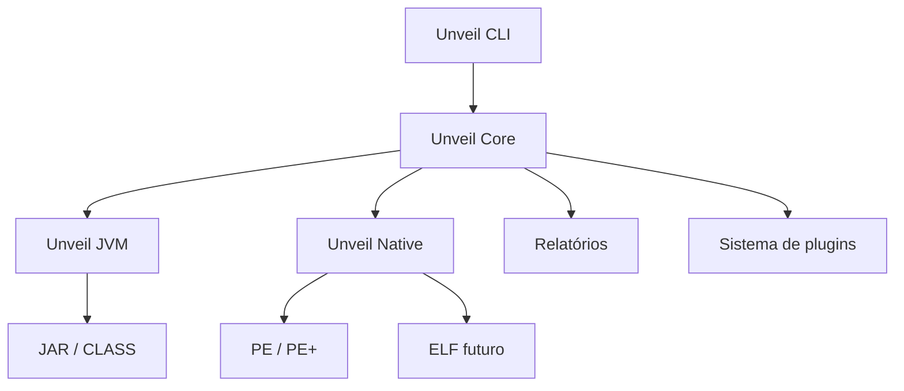
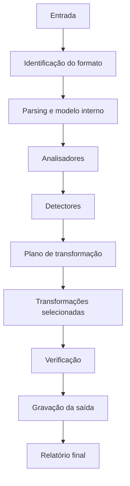

# Unveil

## Framework modular de análise, engenharia reversa e desofuscação de binários

**Documento de arquitetura e planejamento técnico**\
**Estado:** proposta inicial\
**Versão do documento:** 1.0\
**Escopo inicial:** JVM (JAR/Class) e Native (PE/ELF)

---

## 1. Visão geral

O **Unveil** será um framework extensível para análise estática, engenharia reversa e desofuscação de software. Seu objetivo é reunir, sob uma única interface, ferramentas capazes de inspecionar e transformar bytecode JVM e binários nativos sem depender da execução irrestrita do alvo.

O projeto nasce a partir de um deobfuscador já direcionado a três técnicas encontradas em arquivos JAR:

- ofuscação de constantes (`Constant`);
- armazenamento indireto de strings (`StringPooler`);
- criptografia de strings (`StringEncrypt` / `StringDecrypt`).

Essas capacidades formarão o primeiro módulo funcional, o **Unveil JVM**. Paralelamente, a arquitetura já contemplará o **Unveil Native**, responsável por arquivos PE/PE+ no Windows e, posteriormente, ELF no Linux.

O Unveil não deve ser apenas um programa que remove um esquema específico de ofuscação. Ele deve funcionar como uma plataforma na qual analisadores, detectores, transformadores, parsers, geradores de relatórios e plugins possam ser adicionados sem alterar o núcleo do projeto.

> O uso do Unveil deve se restringir a software próprio, amostras de laboratório, pesquisa autorizada, auditoria defensiva e análise de arquivos para os quais exista permissão.

---

## 2. Objetivos

### 2.1 Objetivos principais

1. Analisar arquivos JAR, CLASS, EXE, DLL e, futuramente, ELF.
2. Identificar automaticamente características de ofuscação e empacotamento.
3. Aplicar transformações de forma modular, reproduzível e auditável.
4. Priorizar resolução estática, evitando executar o alvo sempre que possível.
5. Gerar saídas legíveis por humanos e por outras ferramentas.
6. Preservar metadados suficientes para explicar cada alteração realizada.
7. Permitir evolução gradual de um deobfuscador JVM para uma suíte ampla de RE.
8. Servir como projeto de portfólio tecnicamente sólido e documentado.

### 2.2 Não objetivos da primeira versão

- criar um substituto completo para Ghidra, IDA, Binary Ninja ou JADX;
- implementar do zero um decoder completo de instruções x86/x64;
- executar automaticamente código desconhecido fora de um ambiente isolado;
- oferecer devirtualização genérica de qualquer virtualizador comercial;
- suportar simultaneamente todos os formatos e arquiteturas;
- ocultar ou automatizar ações ofensivas contra sistemas de terceiros.

---

## 3. Princípios de arquitetura

### 3.1 Modularidade

Cada análise e transformação deve possuir responsabilidade única e uma interface bem definida. Um módulo de strings não deve depender diretamente da CLI, e um parser de PE não deve conhecer detalhes da JVM.

### 3.2 Análise antes da transformação

O pipeline deve detectar e registrar evidências antes de modificar o arquivo. O usuário poderá executar somente a análise, consultar o plano proposto e então permitir as transformações desejadas.

### 3.3 Transformações determinísticas

Dada a mesma entrada, configuração e versão do Unveil, o resultado deve ser reproduzível. Transformações precisam informar o que encontraram, o que alteraram e o que não conseguiram resolver.

### 3.4 Segurança por padrão

A análise estática será o comportamento padrão. Qualquer emulação, instrumentação ou execução controlada deverá:

- ser explicitamente habilitada;
- possuir limites de tempo e recursos;
- operar em processo ou ambiente isolado;
- bloquear rede por padrão;
- registrar a estratégia utilizada no relatório.

### 3.5 Preservação da entrada

O arquivo original nunca deve ser sobrescrito por padrão. A saída deverá ser gravada em outro caminho, acompanhada de hashes da entrada e do resultado.

### 3.6 Explicabilidade

Toda descoberta deve incluir evidência: classe, método, offset, RVA, instrução, assinatura ou padrão que levou à conclusão. Toda transformação deve registrar antes, depois e justificativa.

---

## 4. Arquitetura de alto nível



O **Unveil Core** coordena o pipeline, configurações, logs, eventos, relatórios e plugins. Os módulos **JVM** e **Native** implementam modelos e operações específicos de cada ecossistema.

---

## 5. Estrutura sugerida do repositório

```text
unveil/
├── README.md
├── LICENSE
├── SECURITY.md
├── CONTRIBUTING.md
├── CHANGELOG.md
├── docs/
│   ├── architecture.md
│   ├── pipeline.md
│   ├── plugin-development.md
│   ├── jvm/
│   └── native/
├── samples/
│   ├── README.md
│   └── generated/
├── tests/
│   ├── integration/
│   ├── regression/
│   └── fixtures/
├── unveil-cli/
├── unveil-core/
│   ├── pipeline/
│   ├── plugin/
│   ├── reporting/
│   ├── configuration/
│   ├── diagnostics/
│   └── workspace/
├── unveil-jvm/
│   ├── loader/
│   ├── model/
│   ├── analysis/
│   ├── detector/
│   ├── transform/
│   │   ├── generic/
│   │   └── schemes/
│   ├── writer/
│   └── verification/
├── unveil-native/
│   ├── format/
│   │   ├── pe/
│   │   └── elf/
│   ├── disasm/
│   ├── analysis/
│   ├── detector/
│   ├── transform/
│   ├── symbols/
│   └── verification/
├── unveil-sdk/
└── tools/
```

### 5.1 Organização de linguagem

Uma composição recomendada é:

| Componente | Linguagem sugerida | Responsabilidade |
|---|---|---|
| `unveil-jvm` | Java 17+ | parsing, análise e reescrita de bytecode JVM |
| `unveil-native` | C++20 | PE/ELF, disassembly, CFG e análise nativa |
| `unveil-cli` | Java, C++ ou Python | interface única e orquestração |
| `unveil-core` | linguagem da CLI ou API neutra | pipeline, relatórios e plugins |
| automações auxiliares | Python 3.11+ | scripts, geração de fixtures e integração |

Para reduzir complexidade no início, a CLI pode nascer em Java junto do módulo JVM. O módulo Native pode expor inicialmente um executável ou biblioteca com saída JSON. Posteriormente, ambos podem ser integrados por uma API estável, bindings ou processo filho bem controlado.

---

## 6. Unveil Core

O Core não deve conter lógica específica de bytecode JVM ou de formatos executáveis. Ele coordena operações comuns.

### 6.1 Responsabilidades

- identificar o tipo da entrada;
- criar um workspace temporário por análise;
- calcular hashes SHA-256;
- selecionar detectores e transformadores;
- resolver dependências e ordem do pipeline;
- publicar eventos e progresso;
- agregar diagnósticos;
- produzir relatórios JSON, texto e HTML;
- controlar políticas de segurança;
- gerenciar plugins e compatibilidade de versões.

### 6.2 Contexto de análise

```java
public interface AnalysisContext {
    InputArtifact input();
    Workspace workspace();
    DiagnosticSink diagnostics();
    FindingStore findings();
    Configuration configuration();
    CancellationToken cancellation();
}
```

### 6.3 Contrato de analisador

```java
public interface Analyzer {
    String id();
    String displayName();
    boolean supports(ArtifactType type);
    AnalysisResult analyze(AnalysisContext context) throws AnalysisException;
}
```

### 6.4 Contrato de detector

```java
public interface Detector {
    String id();
    DetectionResult detect(AnalysisContext context) throws AnalysisException;
}
```

Um `DetectionResult` deve informar:

- confiança de 0 a 100;
- evidências encontradas;
- locais afetados;
- transformadores recomendados;
- possíveis falsos positivos;
- limitações da detecção.

### 6.5 Contrato de transformação

```java
public interface Transformer {
    String id();
    Set<String> requires();
    Set<String> runsBefore();
    Set<String> runsAfter();
    TransformResult transform(TransformContext context)
        throws TransformException;
}
```

Cada `TransformResult` deve conter:

- número de candidatos;
- número de alterações bem-sucedidas;
- número de itens ignorados;
- falhas e motivos;
- alterações registradas;
- avisos de verificação.

---

## 7. Pipeline de processamento



### 7.1 Modos de operação

| Modo | Modifica arquivo? | Finalidade |
|---|---:|---|
| `inspect` | Não | metadados rápidos da entrada |
| `analyze` | Não | análise completa e detecção |
| `plan` | Não | mostra transformações recomendadas |
| `deobfuscate` | Sim | aplica transformações selecionadas |
| `verify` | Não | valida uma saída já produzida |
| `diff` | Não | compara entrada e saída ou duas versões |

---

## 8. Unveil JVM

O Unveil JVM será o primeiro módulo funcional e deverá analisar JARs e arquivos `.class` sem carregar as classes na JVM do processo principal.

### 8.1 Bibliotecas sugeridas

- **ASM:** leitura, análise e escrita de bytecode;
- **picocli:** CLI, caso a interface principal permaneça em Java;
- **Jackson:** relatórios JSON;
- **JUnit 5:** testes;
- **Gradle Kotlin DSL:** build e projeto multi-módulo.

O ASM deve ser usado como base do modelo de transformação. Criar um parser integral do formato `.class` do zero pode existir como projeto educacional separado, mas não deve bloquear o produto principal.

### 8.2 Carregamento de JAR

O loader deverá:

- validar ZIP/JAR e limites contra ZIP bombs;
- preservar recursos não modificados;
- ler `MANIFEST.MF`;
- identificar JARs multi-release;
- carregar classes sem inicializá-las;
- registrar classes inválidas ou versões não suportadas;
- preservar ordem e metadados quando possível;
- detectar assinaturas que serão invalidadas pela reescrita.

### 8.3 Modelo de análise JVM

O contexto JVM poderá indexar:

- classes, interfaces e herança;
- métodos, fields e descriptors;
- constant pool lógico;
- instruções e basic blocks;
- referências entre classes;
- strings e números;
- invocações, reflection e class loading;
- annotations;
- try/catch blocks;
- recursos do JAR.

### 8.4 Transformador: Constant Deobfuscator

Responsável por simplificar expressões cujo resultado pode ser determinado estaticamente.

Exemplo conceitual:

```java
// Antes
int timeout = (125 ^ 53) + 12;

// Depois
int timeout = 88;
```

No bytecode, o transformador deverá reconhecer sequências seguras de operações com operandos constantes, avaliar o resultado respeitando a semântica JVM e substituir a sequência por uma instrução equivalente.

Operações iniciais:

- soma, subtração e multiplicação;
- XOR, AND e OR;
- shifts;
- negação;
- conversões primitivas seguras;
- comparações constantes;
- concatenações triviais conhecidas.

Cuidados necessários:

- overflow deve seguir exatamente as regras da JVM;
- divisão por zero não pode ser dobrada como valor;
- efeitos colaterais impedem a simplificação;
- `NaN`, infinito e precisão de ponto flutuante exigem testes específicos;
- frames e stack map tables devem ser recalculados ou validados.

### 8.5 Transformador: StringPooler Deobfuscator

Responsável por encontrar acessos indiretos a pools de strings e substituir seus call sites pelos valores resolvidos.

```java
// Antes
String header = Strings.get(17);

// Depois
String header = "Authorization";
```

Estratégia inicial:

1. localizar classes candidatas a armazenar o pool;
2. identificar arrays, tableswitch/lookupswitch ou métodos de acesso;
3. reconstruir o mapeamento `índice -> string`;
4. localizar invocações com índice estaticamente conhecido;
5. substituir o call site por `LDC`;
6. remover infraestrutura obsoleta somente quando não houver referências restantes.

O detector deve pontuar evidências como grande quantidade de strings centralizadas, método estático de acesso, índice inteiro constante e numerosos call sites semelhantes.

### 8.6 Transformador: String Decrypt Deobfuscator

Responsável por resolver strings produzidas por rotinas de criptografia ou codificação.

```java
// Antes
String endpoint = decrypt("xJ29as...");

// Depois
String endpoint = "https://example.invalid/api";
```

Ordem de estratégias:

1. avaliação estática de rotinas conhecidas;
2. interpretação limitada de bytecode;
3. emulação controlada de método puro;
4. execução isolada somente se habilitada pelo usuário.

O interpretador inicial pode suportar:

- operand stack e variáveis locais;
- arrays primitivos;
- loops com limites conhecidos;
- operações aritméticas e bitwise;
- `String`, `StringBuilder` e conversões comuns;
- Base64, XOR e transformações de caracteres;
- chamadas explicitamente permitidas em uma allowlist.

O processo deve rejeitar métodos que tentem acessar rede, filesystem, processos, JNI, reflection irrestrita ou APIs não permitidas.

### 8.7 Separação entre técnicas genéricas e esquemas específicos

```text
unveil-jvm/transform/
├── generic/
│   ├── ConstantFolder
│   ├── DeadCodeRemover
│   ├── StringResolver
│   └── RedundantCastCleaner
└── schemes/
    ├── cheatbreaker/
    │   ├── ConstantDeobfuscator
    │   ├── StringPoolerDeobfuscator
    │   └── StringDecryptDeobfuscator
    └── custom/
```

Essa divisão impede que padrões específicos contaminem os algoritmos genéricos e facilita adicionar suporte a novos esquemas.

### 8.8 Transformações futuras para JVM

- remoção de código morto;
- simplificação de opaque predicates;
- limpeza de fluxo de controle;
- resolução de métodos proxy;
- resolução de reflection;
- number decryptor;
- resource decryptor;
- normalização de exception handlers;
- análise de invokedynamic;
- renomeação assistida de classes, métodos e fields;
- call graph e CFG exportável;
- detecção de APIs sensíveis para análise defensiva.

---

## 9. Unveil Native

O Unveil Native analisará executáveis compilados. A primeira implementação deve priorizar **PE32/PE32+ para Windows**, com interfaces preparadas para **ELF**.

### 9.1 Bibliotecas sugeridas

- **LIEF:** parsing e manipulação de PE/ELF;
- **Zydis** ou **Capstone:** disassembly x86/x64;
- **nlohmann/json:** integração por JSON;
- **CLI11:** CLI nativa;
- **Graphviz:** exportação visual opcional de CFG;
- **GoogleTest** ou **Catch2:** testes C++.

O projeto pode implementar parsers próprios de partes selecionadas para aprendizado, porém uma biblioteca madura deve ser usada inicialmente para reduzir erros de formato.

### 9.2 PE Analyzer

O analisador PE deverá extrair:

- DOS Header e NT Headers;
- arquitetura e subsistema;
- image base e entry point;
- section table e permissões;
- imports, delay imports e exports;
- relocations;
- TLS callbacks;
- resources;
- debug directory;
- exception/unwind information em x64;
- certificado e metadados Authenticode;
- overlay;
- hashes por arquivo e seção;
- entropia por seção e por janela;
- anomalias de alinhamento e tamanhos.

Exemplo de saída:

```text
Architecture: AMD64
Image Base:   0x140000000
Entry Point:  0x140013920

Sections:
.text    RVA 0x1000    Entropy 6.21    R-X
.rdata   RVA 0xA4000   Entropy 4.83    R--
.data    RVA 0xD2000   Entropy 2.91    RW-
.vmp0    RVA 0xF0000   Entropy 7.94    RWX  [SUSPICIOUS]
```

### 9.3 ELF Analyzer

O suporte ELF poderá começar como somente leitura e incluir:

- ELF Header;
- program headers e section headers;
- arquitetura, ABI e entry point;
- symbols e dynamic symbols;
- imports e relocations;
- segments e permissões;
- `.init_array` e `.fini_array`;
- interpreter e dependências;
- notas, build ID e informações de debug;
- entropia e anomalias estruturais.

### 9.4 Disassembly

O motor de disassembly não deve tentar decodificar x86/x64 do zero. Zydis ou Capstone deverá fornecer instruções normalizadas, enquanto o Unveil adicionará:

- classificação de branches e calls;
- resolução de destinos diretos;
- referência a imports;
- detecção de RIP-relative addressing;
- referências a strings e constantes;
- basic blocks;
- cross-references;
- heurísticas de function discovery.

### 9.5 Control Flow Graph

O CFG deverá representar basic blocks e transições conhecidas.

Exportações previstas:

- JSON;
- DOT/Graphviz;
- HTML interativo futuramente.

Cada nó deverá registrar endereço inicial, endereço final, instruções, predecessors, successors e confiança da descoberta.

### 9.6 Analisadores nativos iniciais

| Analisador | Resultado |
|---|---|
| `HeaderAnalyzer` | metadados e inconsistências do formato |
| `SectionAnalyzer` | permissões, entropia e layout |
| `ImportAnalyzer` | bibliotecas, APIs e categorias |
| `StringAnalyzer` | strings ASCII/UTF e referências |
| `EntryPointAnalyzer` | primeiras rotas de execução |
| `TlsAnalyzer` | callbacks executados antes do entry point |
| `OverlayAnalyzer` | dados anexados ao fim da imagem |
| `DisassemblyAnalyzer` | instruções, funções e referências |
| `CfgAnalyzer` | basic blocks e grafo de fluxo |
| `PackerHeuristics` | indícios explicáveis de packing |

### 9.7 Heurísticas de packing e proteção

O módulo poderá apontar indícios, nunca declarar certeza apenas por uma evidência. Exemplos:

- seção de alta entropia;
- nomes incomuns de seções;
- entry point fora de seção executável esperada;
- seção RWX;
- imports reduzidos e resolução dinâmica;
- grande diferença entre tamanho virtual e físico;
- overlay relevante;
- padrões ou assinaturas conhecidas;
- TLS callbacks incomuns.

O relatório deve listar os sinais que compuseram a pontuação, permitindo ao usuário avaliar falsos positivos.

### 9.8 Transformações nativas futuras

Na primeira etapa, o Native será prioritariamente analítico. Reescrita de executáveis possui riscos maiores e será adicionada gradualmente.

Possibilidades futuras:

- normalização de cabeçalhos;
- extração de overlay;
- reconstrução assistida de imports em amostras autorizadas;
- patching declarativo e reversível;
- aplicação e exportação de símbolos;
- comparação estrutural entre versões;
- unpacking assistido em laboratório;
- simplificação de fluxo após descompactação;
- geração de assinaturas para pesquisa defensiva.

---

## 10. CLI proposta

### 10.1 Inspeção e análise

```bash
unveil inspect sample.jar
unveil analyze sample.jar
unveil analyze sample.exe --format json --output report.json
unveil plan client.jar
```

### 10.2 Desofuscação JVM

```bash
unveil deobfuscate client.jar -o client-clean.jar
unveil deobfuscate client.jar -o client-clean.jar --transform constant --transform string-pool --transform string-decrypt
```

### 10.3 Análise nativa

```bash
unveil native inspect sample.exe
unveil native imports sample.exe
unveil native strings sample.exe
unveil native disasm sample.exe --entry-point
unveil native cfg sample.exe --function 0x140001000 --format dot
```

### 10.4 Comparação e verificação

```bash
unveil diff client.jar client-clean.jar
unveil verify client-clean.jar
unveil diff program-v1.exe program-v2.exe
```

### 10.5 Exemplo de execução JVM

```text
[Unveil] Input: client.jar
[Unveil] SHA-256: 8f2c...

Classes: 1,482
Methods: 13,291
Strings: 8,194

Detected transformations:
[+] Constant obfuscation   confidence=98  occurrences=2,193
[+] String pool            confidence=96  entries=1,847
[+] Encrypted strings      confidence=91  call-sites=729

[1/5] Parsing classes
[2/5] ConstantDeobfuscator       2,193 simplified
[3/5] StringPoolerDeobfuscator   1,847 restored
[4/5] StringDecryptDeobfuscator    721 restored, 8 unresolved
[5/5] Verifying and writing

Output: client-clean.jar
Report: client-clean.report.json
```

---

## 11. Formato de relatório

O JSON será o formato canônico de integração. Texto e HTML serão renderizações desse modelo.

```json
{
  "schemaVersion": "1.0",
  "tool": {
    "name": "Unveil",
    "version": "0.1.0"
  },
  "input": {
    "path": "client.jar",
    "type": "JAR",
    "sha256": "..."
  },
  "findings": [
    {
      "id": "jvm.string-pool",
      "severity": "info",
      "confidence": 96,
      "locations": ["example/Strings.get(I)Ljava/lang/String;"],
      "evidence": ["1847 indexed string entries"]
    }
  ],
  "transformations": [
    {
      "id": "jvm.string-pool.resolve",
      "status": "success",
      "candidates": 1847,
      "changed": 1847,
      "failed": 0
    }
  ],
  "output": {
    "path": "client-clean.jar",
    "sha256": "...",
    "verified": true
  }
}
```

### 11.1 Severidades sugeridas

- `info`: observação estrutural;
- `low`: anomalia pequena;
- `medium`: comportamento que merece revisão;
- `high`: forte indicador de risco ou quebra de integridade;
- `critical`: reservado a descobertas com impacto claro e evidência forte.

Severidade e confiança devem ser campos diferentes. Uma descoberta pode ser grave, porém possuir baixa confiança.

---

## 12. Sistema de plugins

Plugins poderão fornecer:

- loaders;
- analisadores;
- detectores;
- transformadores;
- exporters;
- assinaturas.

Manifesto conceitual:

```json
{
  "id": "io.unveil.cheatbreaker",
  "name": "CheatBreaker Deobfuscation",
  "version": "0.1.0",
  "apiVersion": "1",
  "entrypoint": "io.unveil.plugins.cheatbreaker.Plugin",
  "capabilities": [
    "jvm.detector",
    "jvm.transformer"
  ]
}
```

Regras importantes:

- versões da API devem ser verificadas;
- plugins não confiáveis não devem ser carregados automaticamente;
- capacidades precisam ser declaradas;
- conflitos de ID devem impedir o carregamento;
- a ordem de execução deve ser resolvida pelo Core;
- falhas em um plugin não devem corromper a entrada original.

---

## 13. Verificação e qualidade

### 13.1 Verificação JVM

Após a transformação:

- validar estrutura de todas as classes;
- recalcular e conferir frames quando necessário;
- garantir que descriptors e referências existam;
- conferir integridade do ZIP/JAR;
- verificar recursos preservados;
- executar testes de carregamento somente com fixtures confiáveis;
- comparar número de classes e recursos esperados;
- informar assinaturas digitais invalidadas.

### 13.2 Verificação Native

- revalidar ranges e offsets;
- impedir leitura fora do arquivo;
- validar RVA para file offset;
- limitar recursão e número de instruções;
- tratar arquivos truncados sem crash;
- separar erro de parsing de anomalia real;
- usar sanitizers e fuzzing nos parsers.

### 13.3 Estratégia de testes

| Tipo | Objetivo |
|---|---|
| unitário | testar instruções, parsers e regras isoladas |
| golden file | comparar saída com relatório esperado |
| round-trip | ler, escrever e reler sem perda indevida |
| regressão | preservar correções de amostras problemáticas |
| property-based | explorar combinações de bytecode e formatos |
| fuzzing | encontrar crashes e leituras inválidas |
| integração | validar pipeline completo |

Fixtures devem ser geradas pelo próprio projeto ou possuir licença clara. Binários e JARs de terceiros não devem ser publicados sem autorização.

---

## 14. Segurança operacional

1. Nunca sobrescrever a entrada por padrão.
2. Não executar `main`, static initializers, DLL entry points ou entry points durante análise estática.
3. Tratar nomes e caminhos internos de arquivos compactados como não confiáveis.
4. Bloquear path traversal ao extrair JARs.
5. Aplicar limites de memória, tamanho, profundidade e tempo.
6. Desabilitar rede em qualquer sandbox de execução.
7. Não carregar DLLs da pasta analisada no processo do Unveil.
8. Abrir arquivos com permissões mínimas necessárias.
9. Registrar quando um resultado veio de execução ou emulação.
10. Evitar incluir secrets, dados pessoais ou amostras privadas em relatórios públicos.

---

## 15. Roadmap

### Fase 0 — Fundação

- repositório multi-módulo;
- licença, README, política de segurança e convenções;
- pipeline básico;
- abstrações de artifact, finding, detector e transformer;
- hashes e relatórios JSON;
- CI com testes e lint.

### Fase 1 — Unveil JVM 0.1

- loader de JAR/CLASS;
- índice de classes e métodos;
- `ConstantDeobfuscator`;
- `StringPoolerDeobfuscator`;
- `StringDecryptDeobfuscator`;
- escrita de JAR;
- verificação estrutural;
- CLI `analyze`, `plan` e `deobfuscate`;
- relatório antes/depois.

**Marco:** transformar com sucesso o projeto atual em um módulo reutilizável do Unveil.

### Fase 2 — Unveil Native 0.1

- loader PE32/PE32+;
- headers, sections, imports, exports e TLS;
- strings e entropia;
- overlay e heurísticas explicáveis;
- relatório JSON compatível com o Core;
- CLI `native inspect`.

**Marco:** analisar EXE/DLL sem executá-los e produzir um relatório técnico útil.

### Fase 3 — Análise estrutural

- JVM CFG e call graph;
- native disassembly x86/x64;
- native basic blocks e CFG;
- cross-references;
- exportação DOT;
- interface HTML inicial.

### Fase 4 — Expansão de transforms

- dead code removal;
- opaque predicate simplifier;
- proxy method resolver;
- reflection resolver limitado;
- transforms específicos como plugins;
- diff de bytecode e binários.

### Fase 5 — ELF e SDK

- loader e analisadores ELF;
- SDK documentado;
- templates de plugins;
- estabilidade da API v1;
- bindings e integrações externas.

### Fase 6 — Pesquisa avançada

- emulação controlada mais abrangente;
- análise dinâmica opcional em sandbox;
- unpacking assistido;
- comparação estrutural de funções;
- assinaturas geradas a partir de findings;
- suporte adicional a arquiteturas.

---

## 16. Backlog priorizado

### Prioridade alta

- migrar os três deobfuscators existentes para interfaces comuns;
- criar fixtures pequenas para cada padrão;
- gerar relatório de transformações;
- impedir sobrescrita da entrada;
- validar JAR resultante;
- definir schema JSON versionado;
- implementar parser PE somente leitura.

### Prioridade média

- detecção automática com confiança;
- pipeline configurável;
- CFG JVM;
- análise de entropia e imports PE;
- interface de plugins;
- HTML report;
- diff entre original e resultado.

### Prioridade futura

- ELF;
- disassembly multi-arquitetura;
- interpretador JVM mais completo;
- sandbox de execução;
- análise dinâmica;
- reescrita nativa;
- interface gráfica.

---

## 17. Entregáveis para um GitHub forte

O repositório deve apresentar o projeto de forma verificável:

- README com proposta clara e GIF ou screenshots;
- diagrama da arquitetura;
- exemplos reproduzíveis usando fixtures próprias;
- documentação de cada transformação;
- relatório de exemplo em JSON e HTML;
- testes automatizados visíveis no CI;
- cobertura de testes;
- releases com binários ou pacotes;
- changelog;
- documentação para criar plugins;
- seção de limitações conhecida e honesta;
- benchmarks com metodologia descrita;
- lista de decisões arquiteturais relevantes.

Uma demonstração ideal mostrará:

1. o código de uma fixture antes da ofuscação;
2. o bytecode ou fonte decompilada depois da ofuscação;
3. a detecção feita pelo Unveil;
4. o JAR restaurado;
5. o diff e o relatório das alterações.

---

## 18. Critérios de conclusão da versão 0.1

A versão 0.1 poderá ser considerada pronta quando:

- aceitar um JAR por CLI;
- analisar o arquivo sem executar suas classes;
- detectar ao menos os três esquemas iniciais;
- aplicar cada transformação isoladamente ou em conjunto;
- produzir um novo JAR sem sobrescrever o original;
- produzir relatório JSON com evidências e contadores;
- verificar estruturalmente o resultado;
- possuir fixtures e testes de regressão;
- documentar claramente limitações e uso autorizado;
- incluir um módulo Native capaz de inspecionar os principais metadados de PE, mesmo que ainda não realize transformações.

---

## 19. Próxima decisão técnica

Antes da implementação, deve-se escolher a forma de integração entre os módulos:

### Opção A — Monorepo com processos independentes

- JVM implementado em Java;
- Native implementado em C++;
- cada módulo oferece sua própria CLI interna;
- a CLI principal chama o engine adequado e consome JSON.

**Vantagem:** simples, desacoplado e fácil de depurar.\
**Desvantagem:** comunicação por processo possui algum overhead.

### Opção B — Native como biblioteca carregada pela JVM

- engine C++ exposto via JNI/JNA;
- uma única CLI Java.

**Vantagem:** integração direta.\
**Desvantagem:** distribuição, ABI, crashes nativos e build ficam mais complexos.

### Opção C — CLI principal em Python

- Python orquestra Java e C++;
- engines continuam independentes.

**Vantagem:** automação rápida.\
**Desvantagem:** adiciona um terceiro runtime ao produto.

### Recomendação

Começar pela **Opção A**. O contrato JSON permite evoluir os dois engines de forma independente, evita JNI prematuro e mantém o projeto compreensível. Se o overhead se tornar relevante, bindings podem ser adicionados depois sem reescrever os analisadores.

---

## 20. Resumo da primeira implementação

O primeiro ciclo de desenvolvimento deve produzir:

```text
Unveil 0.1
├── Core
│   ├── pipeline
│   ├── findings
│   ├── diagnostics
│   └── JSON report
├── JVM
│   ├── JAR loader/writer
│   ├── ConstantDeobfuscator
│   ├── StringPoolerDeobfuscator
│   ├── StringDecryptDeobfuscator
│   └── structural verifier
└── Native
    ├── PE loader
    ├── headers and sections
    ├── imports and exports
    ├── TLS and overlay
    ├── strings and entropy
    └── JSON report
```

Essa versão já apresenta valor real: recupera bytecode JVM ofuscado, inspeciona executáveis nativos sem executá-los e estabelece uma arquitetura sobre a qual CFG, disassembly, diff, plugins e análises mais avançadas poderão ser construídos.

---

## 21. Nome e posicionamento

**Nome:** Unveil\
**Descrição curta:** *A modular framework for binary analysis and deobfuscation.*\
**Descrição alternativa:** *Static analysis and deobfuscation toolkit for JVM and native binaries.*

Sugestão de tópicos para o GitHub:

```text
reverse-engineering
deobfuscation
static-analysis
java-bytecode
jvm
pe-analysis
elf
binary-analysis
cpp
java
security-research
```

---

## 22. Licenciamento sugerido

Para um projeto aberto de portfólio, duas opções são especialmente adequadas:

- **Apache License 2.0:** permissiva e com cláusulas explícitas de patentes;
- **GNU GPLv3:** exige que distribuições derivadas mantenham o código correspondente aberto.

Se a intenção for facilitar adoção, integração e contribuições, a recomendação inicial é **Apache-2.0**. A escolha final deve ser feita antes de aceitar contribuições externas relevantes.
