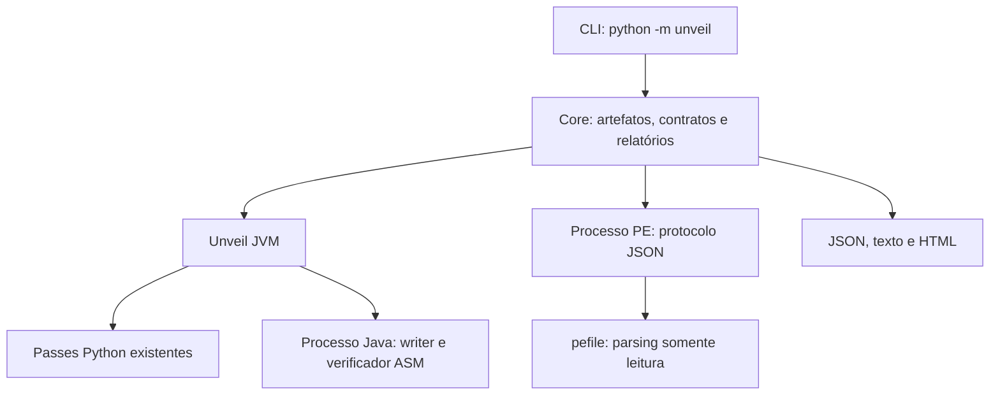

# Arquitetura do Unveil

Referência: [proposta original](Unveil_Project.md), seções 4–9, 18 e 20.

## Decisão de implementação inicial

O código existente implementa os três passes em Python, com interpretação limitada e escrita em Java/ASM. Esta etapa extrai o pipeline para `unveil.jvm.pipeline` e mantém essas implementações. `main.py` preserva a CLI anterior, inclusive NameRecovery, e encaminha os novos comandos ao framework.

O Native usa **pefile**, biblioteca especializada já compatível com o runtime Python do projeto. O Core chama seu worker como processo filho, com contrato JSON, timeout de 60 segundos e caminho absoluto da entrada. Não existe JNI nem carregamento de DLLs analisadas. O timeout encerra o processo de parsing; isso não constitui uma sandbox de sistema operacional.

Essa é uma implementação incremental próxima da opção C da seção 19, com separação por processos. **Ainda não é a opção A sugerida, com engines integralmente em Java e C++20.** O contrato de relatório permite substituir o worker PE por um engine C++ posteriormente. A mudança evita descartar os passes e testes funcionais durante a introdução do Core.

## Responsabilidades

| Módulo | Responsabilidade |
|---|---|
| `unveil/core/model.py` | identificação por assinatura, SHA-256, contexto e contratos |
| `unveil/core/registry.py` | IDs únicos, versão da API, dependências e ciclos |
| `unveil/core/engine.py` | seleção de analisador e chamada ao worker PE |
| `unveil/core/reporting.py` | serialização, HTML escapado e publicação de relatórios |
| `unveil/jvm/analysis.py` | JAR/CLASS, índice, evidências, plano e verificação |
| `unveil/jvm/transforms.py` | contratos comuns para os três planejadores |
| `unveil/jvm/pipeline.py` | iteração, reescrita, validação e publicação do JAR |
| `unveil/native/pe.py` | PE32/PE32+, seções, imports, exports, TLS e heurísticas |
| `deobf/` | parser, interpretador e passes existentes; NameRecovery |
| `helper/` | código Java confiável e dependências ASM |

## Contratos e extensibilidade

Os protocolos `Analyzer`, `Detector` e `Transformer` estão em `model.py`. O registro de componentes é explícito e valida conflitos de IDs e versões. A ordenação é topológica e determinística; dependências ausentes e ciclos produzem erros. Os três transforms JVM podem ser selecionados separadamente; a ordem relativa permanece constantes → pool → decrypt.

O registro ainda não carrega manifests externos. Não há descoberta automática de plugins nem promessa de isolamento para componentes Python registrados pelo desenvolvedor. O SDK distribuível e a integração de plugins de terceiros são fases posteriores.

## Limites conhecidos

- A identificação aceita JAR/ZIP, CLASS e PE. ELF retorna erro explícito.
- CLASS individual pode ser inspecionado, analisado e verificado; reescrita requer JAR.
- Variantes multi-release com nomes internos repetidos são inventariadas, mas os passes não as transformam juntos.
- Os limites de arquivo/ZIP restringem bytes de entrada; não são um teto de memória dos modelos Python.
- O parser JVM existente continua sendo usado para análise. A migração de todo esse modelo para ASM permanece pendente.
- Verificação ASM não comprova linkage completo, equivalência semântica ou preservação de identidade de strings internadas.
